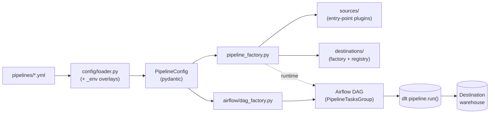

# dlt_data_pipeline

A shared **dlt + Airflow Fivetran replacement**. Sync data from many sources
(REST APIs, SQL databases, files / S3) to many destinations (Snowflake,
Postgres, DuckDB, Databricks) with full-refresh, incremental, and CDC sync
modes. Engineers add new pipelines by contributing **one YAML file** — zero
Python edits in the common case.

> **For AI agents** working in this repo (Claude Code, Codex, Cursor): the
> agent-facing brief lives in [`AGENTS.md`](AGENTS.md) (and
> [`CLAUDE.md`](CLAUDE.md), a symlink). It covers the MCP server,
> introspection CLI, env-var convention, CDC ops, and dry-run flow.

## Architecture



Design contract: `pipeline_factory` and everything under `sources/`,
`destinations/`, `config/`, `cli/` is **orchestrator-agnostic** — only
`src/dlt_data_pipeline/airflow/` and `dags/` may `import airflow`. Enforced
by ruff `flake8-tidy-imports`.

## Quickstart

```bash
docker compose -f docker/docker-compose.yml up -d
scripts/seed_local.sh                       # seed postgres-source with sample data
open http://localhost:8080                  # Airflow UI (admin / admin)
```

Compose brings up: `postgres-airflow` (metadata DB), `postgres-source`
(exposed on `localhost:5433`), `postgres-destination` (`localhost:5434`),
`airflow-init`, `airflow-webserver`, `airflow-scheduler`,
`airflow-triggerer`. All Airflow components share one image
(`dlt_data_pipeline:local`) built from [`docker/Dockerfile`](docker/Dockerfile).

Run one pipeline outside Airflow for a fast smoke test:

```bash
docker compose -f docker/docker-compose.yml exec airflow-scheduler \
    python -m dlt_data_pipeline run example_rest_to_duckdb --limit 1 --no-load
```

`--limit 1 --no-load` validates source connectivity + schema inference
without writing to the destination — see [`AGENTS.md`](AGENTS.md) for the
full dry-run flow.

## Add a pipeline in ~10 minutes

1. **Scaffold** a YAML from source + destination metadata:

    ```bash
    uv run python scripts/new_pipeline.py my_pipeline \
        --source rest_api --dest duckdb
    ```

    Writes `pipelines/my_pipeline.yml` with required keys as TODO
    placeholders and the `# yaml-language-server: $schema=./_schema.json`
    directive for editor autocomplete.

2. **Fill in** source / sync / destination / schedule. Schema reference:
   [`pipelines/_schema.md`](pipelines/_schema.md) and
   [`pipelines/_schema.json`](pipelines/_schema.json). Existing examples
   under [`pipelines/`](pipelines/) (REST→duckdb, pg→pg incremental,
   pg→pg CDC, filesystem→duckdb).

3. **Add credentials** under the env-var convention documented in
   [`AGENTS.md`](AGENTS.md) — local dev via `.dlt/secrets.toml`, prod via
   k8s `Secret` env-mounts.

    ```bash
    export SOURCES__REST_API__MY_API__CREDENTIALS=...
    export DESTINATION__DUCKDB_LOCAL__CREDENTIALS=...
    ```

4. **Validate without running**:

    ```bash
    uv run python -m dlt_data_pipeline pipelines validate my_pipeline
    uv run python -m dlt_data_pipeline pipelines doctor
    ```

5. **Restart Airflow** (or wait for the DagBag re-parse) — the new DAG
   appears in the UI. Click "Trigger DAG" to run once and verify rows
   landed in the destination.

Full CLI surface in [`src/dlt_data_pipeline/cli/README.md`](src/dlt_data_pipeline/cli/README.md).

## Repository structure

Top-level layout — each entry links into its per-component README via the
Component Map below.

```
dlt_data_pipeline/
├── pyproject.toml                  # deps, ruff/mypy/pytest, entry-points
├── .env.example                    # documents required env vars (non-secret)
├── AGENTS.md                       # agent brief (CLAUDE.md is a symlink)
├── README.md                       # this file
├── data_pipeline_plan.md           # design log + segment history
├── docker/
│   ├── Dockerfile                  # single shared image: webserver/scheduler/triggerer/worker
│   ├── docker-compose.yml          # local stack
│   └── postgres-source-init/       # CDC bootstrap: wal_level=logical + replicator role
├── airflow_home/
│   ├── airflow.cfg                 # baseline; env-override via AIRFLOW__<SECTION>__<KEY>
│   └── pod_templates/base.yaml     # authoritative KubernetesExecutor pod template
├── dags/
│   ├── data_pipeline_dags.py       # DagBag entry; assigns generated DAGs to globals()
│   └── heartbeat_check.py          # scheduler/triggerer liveness DAG
├── pipelines/                      # USER-FACING: one YAML per pipeline
│   ├── _schema.json                # generated from pydantic models
│   ├── _schema.md                  # human reference
│   ├── _env/                       # per-env overlay files keyed by pipeline name
│   └── example_*.yml
├── src/dlt_data_pipeline/
│   ├── __main__.py                 # CLI entry: python -m dlt_data_pipeline …
│   ├── pipeline_factory.py         # PipelineConfig -> runnable dlt.pipeline (airflow-free)
│   ├── mcp_server.py               # FastMCP server exposing introspection tools
│   ├── config/                     # pydantic models, YAML loader, env overlays
│   ├── sources/                    # plugin registry + rest_api / sql_database / filesystem / pg_cdc
│   ├── destinations/               # factory + metadata + registry (duckdb, postgres, snowflake)
│   ├── airflow/                    # dag_factory, callbacks, sensors, quality tasks
│   ├── observability/              # alerts (Slack/SMTP), secret-scrubbing log filter
│   └── cli/                        # per-subcommand modules wrapped by __main__
├── deploy/k8s/
│   ├── base/                       # KubernetesExecutor manifests + pod template + RBAC
│   └── overlays/{dev,staging,prod}/
├── tests/
│   ├── unit/
│   ├── integration/
│   └── fixtures/                   # rest_cassettes, files/, pipeline YAML fixtures
├── scripts/
│   ├── new_pipeline.py             # YAML scaffolder
│   ├── seed_local.sh
│   └── seed_source.sql
├── .claude/skills/add-pipeline/    # slash skill: scaffold -> validate -> doctor
├── .mcp.json                       # registers the local MCP server
├── .dlt/
│   ├── config.toml                 # committed non-secret dlt config
│   └── secrets.toml                # GIT-IGNORED local credentials
└── .github/workflows/ci.yml        # lint + unit + integration matrix + build-and-push
```

## Component map

| Path | Purpose |
|---|---|
| [`src/dlt_data_pipeline/config/`](src/dlt_data_pipeline/config/README.md) | Pydantic schema, YAML loader, env overlays, secrets resolver. |
| [`src/dlt_data_pipeline/sources/`](src/dlt_data_pipeline/sources/README.md) | Source-type plugin registry (REST, SQL, filesystem, pg_cdc). |
| [`src/dlt_data_pipeline/destinations/`](src/dlt_data_pipeline/destinations/README.md) | Destination factory + metadata (duckdb, postgres, snowflake). |
| [`src/dlt_data_pipeline/airflow/`](src/dlt_data_pipeline/airflow/README.md) | DAG factory, callbacks, sensors, quality tasks. |
| [`src/dlt_data_pipeline/observability/`](src/dlt_data_pipeline/observability/README.md) | Alerts (Slack/SMTP), schema-change events, secret-scrubbing filter. |
| [`src/dlt_data_pipeline/cli/`](src/dlt_data_pipeline/cli/README.md) | `python -m dlt_data_pipeline …` subcommands. |
| [`pipelines/`](pipelines/README.md) | User-facing YAMLs + schema + env overlays. |
| [`docker/`](docker/README.md) | Single shared image; local dev compose stack. |
| [`tests/`](tests/README.md) | Unit + integration tests; live-creds gating. |
| [`deploy/k8s/base/`](deploy/k8s/base/README.md) | KubernetesExecutor prod manifests (Segment 10). |

## Post-v1 considerations

**PII / governance** is explicitly out of v1 scope: field-level masking
/ hashing / column exclusion and GDPR delete propagation
(`schema_contract: freeze` is not sufficient for regulated destinations).
Revisit post-v1 — see the "PII / governance" entry under
[Tricky Parts in `data_pipeline_plan.md`](data_pipeline_plan.md#tricky-parts).

## Further reading

- [`data_pipeline_plan.md`](data_pipeline_plan.md) — full design, segment
  log, Tricky Parts catalogue.
- [`AGENTS.md`](AGENTS.md) — agent brief (also read by Claude Code as
  `CLAUDE.md`).
- Each per-component README under the Component Map above.
